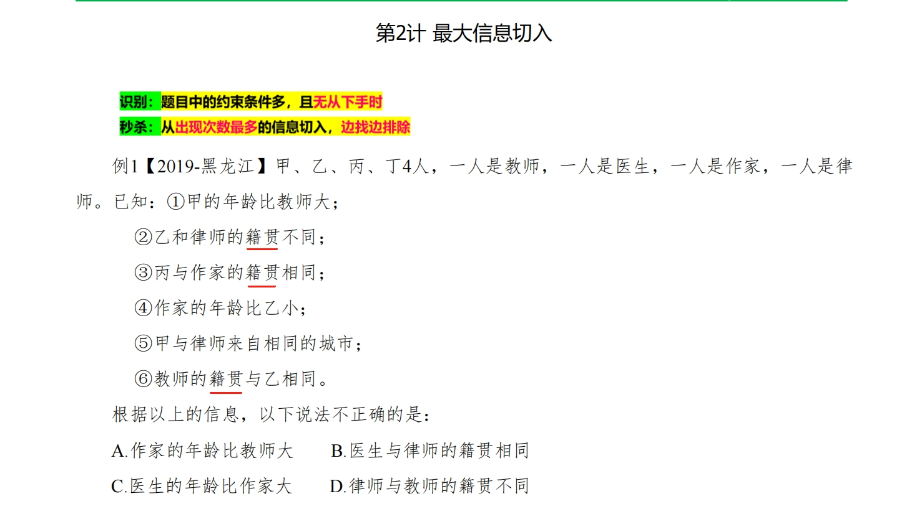

### 2.最大信息切入

#### 例1

其实感觉这个为了找出现次数最多是为了

#### 例6
大学生甲、乙、丙、丁、戊、己选修了“中国文学经典阅读”这门课，老师列出《论语》《史记》《唐诗三百首》《古文观止》4部经典让大家选读。甲和丙两人选择的经典全部相同，丁与己两人选择的经典全部相同。6人中，每人都选择了两部经典，而每部经典都至少有两人选择，至多有4人选择。另外，6人选择还存在如下特征：

①如果丁选择《论语》，则甲和乙都选择《史记》；

②如果甲和乙两人中至少有一人选择《论语》，则丁也选择《论语》；

③如果丁和丙两人中至少有一人选择《唐诗三百首》，则己选择《史记》。

根据以上陈述，可以得出以下哪项（ ）。