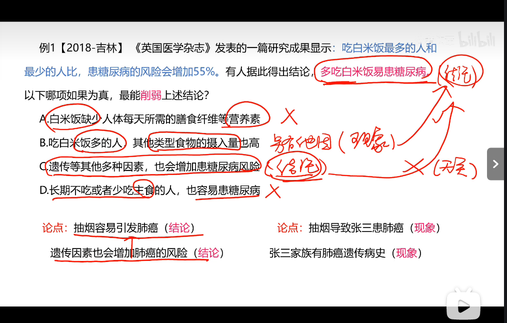

### 1.否定论点

#### 例 1
【2021-多省联考】小米熬成稀粥后，大分子淀粉会发生水解反应，产生小分子 
的糊精和少量脂肪，这些成分都浮在粥的表面，稍稍冷却后形成一层薄薄的米油。有人 
说，小米粥上的这层米油营养价值极高，滋补能力极强，还可以保护胃黏膜。 
 以下各项如果为真，最能质疑上述观点的组合是： 
 ①未精制的小米富含维生素 B1 B2 和钾 成分 
 ②米油没有什么极高营养价值和极强的滋补能力 
 ③米油可助消化，但助消化并不等于营养价值高 
 ④研究表明，米油 胃黏膜没有明显的保护作用 
A.①③ B.②④ C.①③④ D.②③④

论据：论点：小米粥上的这层米油营养价值极高，滋补能力极强，还可以保护胃黏膜

3 为什么错？米油可助消化，但助消化并不等于营养价值高。同样也不等于营养价值不高。

#### 例 2
【2016-山东】骨质疏松是一种骨钙质减少，骨脆性增加，易发骨折的疾病。现 
有的治疗手段比如使用雌激素或者降钙素有助于阻止进一步的骨质减少但不能增加骨头质 
量。氟化物被认为能增加骨质， 
断。 
 以下哪项如果为真，能够削弱文中观点？ 
A.大多数患骨质疏松症的人没有意识到注入氟化物可以增加骨质 
B.牙膏中常加入氟化物来起到坚固牙齿的作用 
C.氟化物注入健康人的体内会导致较强的副作用 
D.通过注入氟化物增加的骨质比正常的骨骼组织更加脆弱而缺少弹性 

论据：氟化物被认为能增加骨质 论点：给骨质疏松症患者注入氟化物会帮助他们的骨骼不容易折

A. 主观意图，没有意识到并不能说明注入氟化物可以增加骨质
B. 牙齿不是骨骼
C. 带副作用必然不选，带不带副作用不影响氟化物是否能增加骨质

#### 例 3
【2018-多省联考】水熊虫是一种小型水生动物，又 缓步动物。水熊虫是地球 
上已知生命力最强的生物，它可以在没有防护措施的 件下，在极端压力环境中生存。缓 
步动物的奇特能力促使研究人员 其基因组展开调查。目前， 缓步动物的第一次基因组 
测序结果显示，在缓步动物演化过程中，通过水 基因转移（不同物种基因组之间的 DNA 
转移），从其他物种中获得了大量基因。 
以下各项如果为真，最能质疑上述观点的是： 
A. 基因检测发现水熊虫体内有一种基因，其蛋白质能够抵抗人类培养细胞内的 DNA 
损伤
B. 水熊虫可以在太空真空环境中长时间生存，在冰冻 30 多年之后也能成功复苏 
C. 水熊虫从祖先那里继承所有基因，没有发现来自植物或者微生物的体内遗传物质 
D. 水熊虫体内遗传物质存在一种非常奇怪的“混搭”法，正是这种“混搭”才使水熊 
虫以更复杂的方式生长和发育

D是无关选项，混搭没有说明和谁混搭？。这题没有论据

#### 例4

例 4【2022-国考】动物实验发现，和处于寒冷环境的同 大小的小鼠 比，温暖环 
境小鼠的骨密度明显增强，很少出现骨质疏松。与此同时，温暖环境中小鼠的肠道菌群更 
为活跃，当把这些小鼠的肠道菌群移植到寒冷环境的小鼠肠道后，后者骨密度也增强了。 
由此可见，只要改善肠道菌群活性就可以增强骨密度。 
 以下哪项如果为真，最能削弱上述证？ 
A.肠道中不是所有的细菌都会引起成骨细胞的增加，从而增加骨密度 
B.改善肠道菌群活性还须与生活环境和饮食习惯 结合才能增强骨密度 
C.改善肠道菌群活性 于年老小鼠增加骨密度的作用不十分明显 
D.接受菌群移植的小鼠若持续处于寒冷环境，骨密度会很快再次降低至原有水 

### 2. 削弱论据

#### 例 1
【2017-广州】烟雾中毒是室内火灾最常见的致命因素。某推销员声 ，他所在 
公司生产的新型火灾报警器内置声音感应器，房屋建筑材料暴露于高温时会发出的独特声 
音，报警器能够精确探测这些声音，并在建筑材料实际着火前便发出警报，使住户能在被 
烟雾困住之前逃离，因此可以很好地取代传统烟雾报警器。  
以下哪项如果为真，将最有力削弱推销员的 述？  
A.许多房屋建筑材料实际着火时发出的声音在几百米之外可以听得见 
B.许多室内火灾开始于床垫和沙发，产生大量烟雾却不发出声音 
C.有数据表明，烟雾报警器的使用拯救了许多生命  
D.内置声音感应器的报警系统比传统烟雾报警系统的安装费用高得多 

#### 例 2
【2015-河南】某品牌的新型插座产品中包含防雷击部件，在电器遭到雷击后能 
保证所连接电器不受损害，有人提出，应将这种部件作为标准配件安装到该品牌所有的插 
座产品中；另有人认为这么做会提高产品成本，降低其在行业内的价格竞争优势，且国内 
行业标准并没有强制要求产品加入防雷部件，故没有 要加装防雷击部件。  
以下哪项如果为真，最能削弱上述反对意见？  
A.  越来越多的其它品牌的插座也开始加入了防雷部件  
B.  调查显示大多数消费者 其电路遭受雷击并不感到担忧  
C.  在家电遭受雷击的已知案例中，使用了该新型插座的家电都没有受损  
D.  在即将发布的国家标准中，强制要求所有插座产品都包含防雷击部件  

### 3. 拆桥

#### 例 1
【2018-浙江选调】某电视综艺节目播出后，节目导演声称该节目达到了当前同 
类节目的最高水准，因为该节目收视率比同类节目高出2％。  
以下哪项如果为真，最能削弱上述论证？  
A.  参与该节目的嘉宾 节目评价不一  
B.  观众本身就非常喜欢 电视综艺节目  
C.  该导演的微博有几十万 批评此节目的评  
D.  节目的水准和收视率并  然关联

### 4. 否定前提

例 1【2019-山东】化学名 为聚四氟乙烯 商用名 为特氟龙的物质被广泛应用于 
电饭煲内胆。有研究证明，超过 260 度高温作用下该物质会变为毒性物质，因此有人认为 
电饭煲会做出“毒米饭”。  
以下哪项如果为真，最能质疑上述观点？  
A.特氟龙作为涂层特别容易剥落混到食物中  
B.特氟龙内胆的电饭煲工作温度最高为 119 度  
C.特氟龙在高温 件下产生的毒性足以致癌  
D.特氟龙材料还被应用到医疗 冶金 领域中

#### 否定相同前提

#### 例 6
【2018-北京】某国总统竞选活动中，候选人 G 在 X 州获得 5 万多张选票，在 Y 
州获得 3 万余张选票。据此，约翰先生认为，G 在 X 州有更高的支持率。  
以下哪项如果为真，能够反驳约翰先生的观点？  
A.候选人 G 到 X 州做过宣传演讲，但未曾去过 Y 州  
B.候选人 G 是基督徒，X 州比 Y 州的基督徒多得多  
C.X 州支持候选人 G 的女性多于 Y 州  
D.Y 州的人口仅有 X 州人口的一半

### 4. 因果倒置

#### 例 1

【2018-广东】有研究小组调查显示，在封闭环境中入睡的人更容易频繁醒来， 
而且自我感觉睡眠质量不佳。因此，有人认为，就寝时关闭门窗将会降低睡眠质量。 
以下哪项为真，最能削弱上述结论？  
A.研究小组调查的对象大多是年轻人  
B.睡眠质量差的人更喜欢关闭门窗睡觉  
C.门窗紧闭会影响室内空气质量，从而影响睡眠  
D.由于安全 保暖 原因，夜间开窗并不适合所有房间 

### 5. 另有他因

#### 例1

【2018-广州】 每周饮酒 2-10 次是适量饮酒。有调查发现，每周饮酒 2-10 次的 
男士，比每周饮酒少于 2 次的男士患 脏病的概率要低。因此，适量饮酒可降低男士患心 
脏病的风险。  
以下哪项为真，最不能削弱该证？  
A.适量饮酒的女士比每周饮酒少于 2 次的女士患肝炎的概率更高  
B.适量饮酒的男士更注意加强身体锻炼  （另有他因） 
C.适量饮酒的男士普遍比每周饮酒少于 2 次的男士要年轻（另有他因） 
D.男士们都认为，身体良好的情况下可以适当增加饮酒量 （因果倒置）

### 6. 双因串联

例 2【2016-国考】有研究者认为，有些人罹患哮喘病是由于情绪问题。焦虑 抑郁
和愤怒 消极情绪，可促使机体释放组织胺 物质，从而引发哮喘病。但是，反 者认
为，迷走神经兴奋性的提高和交感神经反应性的降低才是引发哮喘病的原因，与患者的情
绪问题相关。 以下哪项如果为真，最能削弱反 者的观点？ 
A.现代医学已经证实，消极情绪也可诱发身体疾病 
B.哮喘病发作会造成患者情绪焦虑 抑郁和愤怒  
C.焦虑 抑郁和愤怒 消极情绪是现代人的普遍问题 
D.消极情绪会提高患者迷走神经的兴奋性并降低交感神经的反应性
