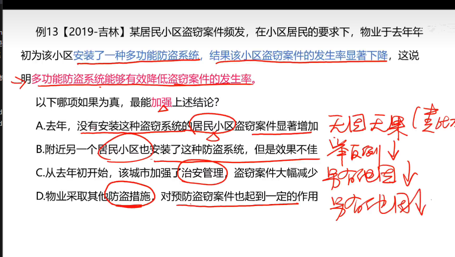

### 1. 加强

论点:经常喝酸奶可降低儿童患蛀牙的风险

①解释论点成立的原因:酸奶中所含的蛋白质能附着在牙齿表面，从而预防有害酸侵蚀牙齿

补充正面论据:有研究表明，儿童每周至少食用4次酸奶可将蛀牙发生率降低15%

③举正例: 西欧地区儿童历来有喝酸奶的传统，儿童蛀牙发生率普遍偏低

力度比较:解释原因>补充正面论据>举正例

#### 例 1
【2021-新疆】近日，有研究统计全球疟原虫感染率与癌症死亡率的关系，发现 
剔除经济 环境 医疗水  干扰因素后，二者之间仍然存在显著的负 关性。在后续的 
实验中，实验者让小鼠患上刘易斯肺癌，接着 实验组小鼠注射疟原虫，结果显示，感染 
疟原虫的小鼠生存时间大大增加。于是研究者宣 “疟原虫感染可以治疗癌症”。  
以下哪项如果为真，最能支持上述结 ？  
A.  疟原虫感染率越高的地区，癌症死亡率越高  
B.  实验时间普遍较短，长期的安全性与有效性未知  
C.  小鼠感染疟原虫后的症状与人类不同，动物实验有效不 于人体治疗有效  
D.  疟原虫入侵人体之后，可以激活 NK 细胞，NK 细胞可以同时杀死疟原虫和癌细胞 

#### 类比加强

张三听了仰老师的课，成绩提高了 => 张三成绩提高是因为听了仰老师的课。

李四没听仰老师的课，成绩下降了。

#### 例13

### 2. 必要前提

1、必要前提:选项为论点成立的必要条件(没他不行)

#### 例 1
【2021-广东选调】 鉴于“天价宰客”现象不断出现，只要 关职能部门能够加 
大惩处力度，就能让违法成本高于违法收益，让漠视消费者权益的经营者深刻感受违法违 
规的惨痛代价。那么，就算是再 良的经营者也不敢以身试法，侵犯消费者的权益。  
        上述推 最有可能基于的前提是（      ）。   
A.违法成本是所有经营者 法承受的  
B.侵犯消费者权益的行为 然会被惩处  
C.违法收益越高违法成本越高  
D.“天价宰客”现象全国各地都有发生 

