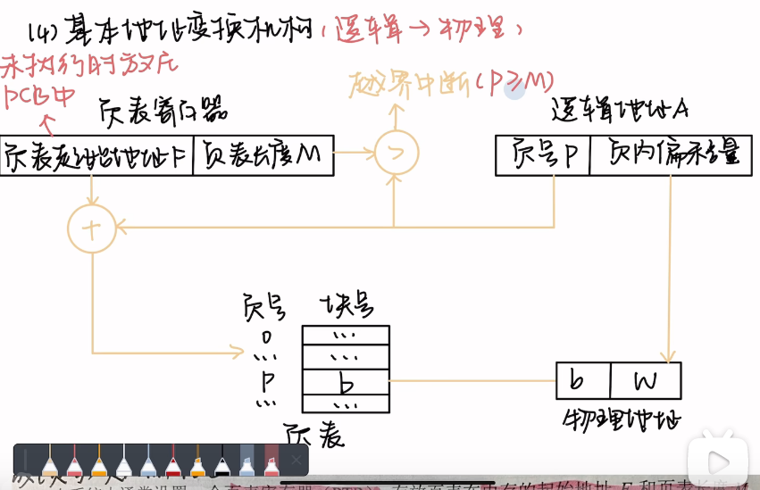
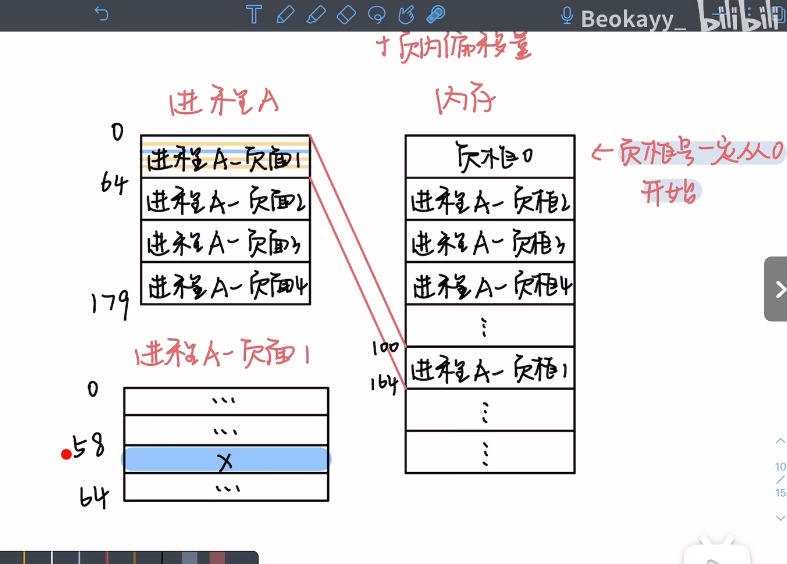

### 操作系统

#### 基本分页存储管理

分页的过程是将逻辑内存地址，转换为物理地址。

页号看是否有越界，超越页表长度。然后加上页表起始地址F。然后再加上页内偏移地址就是物理地址。

逻辑地址和物理地址的对应关系

### C语言

### 数据结构

#### 快速排序

对下列 4 个序列用快速排序[1]方法进行排序，以序列的第 1 个元素为基准进行划分。在第 1 趟划分过程中，元素移动次数最多的是序列（）

A）70,75,82,90, 23,16,10,68

B）70,75,68,23,10,16,90,82

C）82,75,70,16,10,90,68,23

D）23,10,16,70,82,75,68,90

### 计算机网络

#### 网络端口号

FTP 控制端口号21 ，数据端口号20

DNS 53

